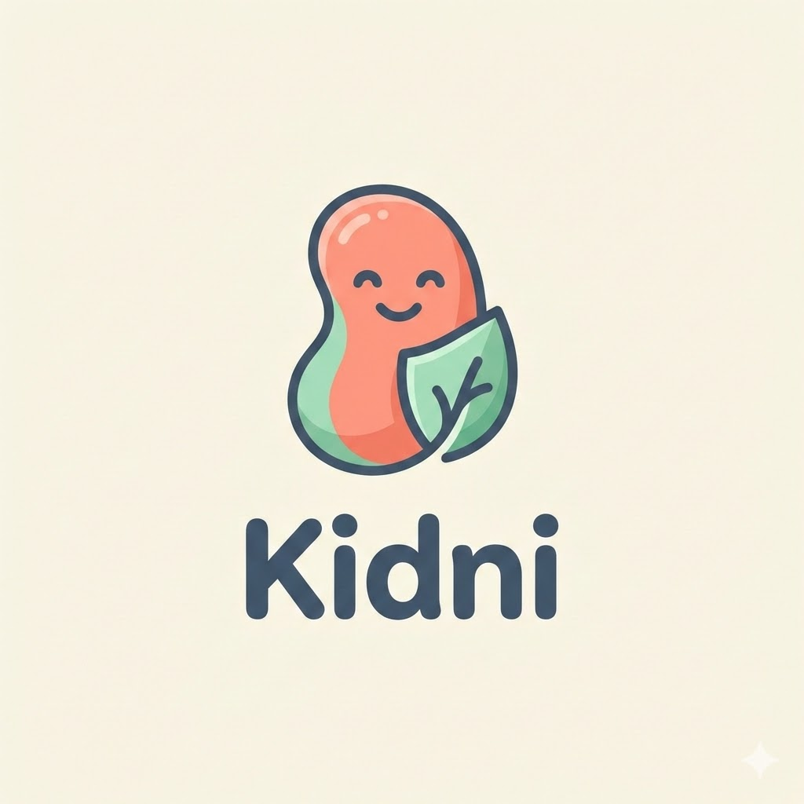

# Kidni - קידני

<div align="center">

**Kidni - קידני • Empowering caregivers through interactive education**



### **Transforming Medical Complexity into Interactive Learning**

*An evidence-based mobile application that gamifies dietary management for children with Chronic Kidney Disease*


**Built with ❤️ for the fighters of the Dialysis Department**

[Features](#-key-innovations) • [Demo](#-application-flow) • [Architecture](#-technical-architecture) • [Installation](#-getting-started) • [Documentation](#-documentation)

</div>

---

## 📖 Overview

**Kidni** is a specialized mobile application designed to simplify the complex dietary management required for children with **Chronic Kidney Disease (CKD)** and those undergoing dialysis.

Managing levels of **Phosphorus (זרחן)** and **Potassium (אשלגן)** is critical for these patients, yet the information is often dry, overwhelming, and difficult to apply in real-world scenarios. Parents face the constant challenge of making split-second decisions in grocery stores and kitchens—decisions that directly impact their child's health.

**Kidni bridges this gap** by transforming medical dietary guidelines into an **engaging, visual, and gamified experience** that empowers caregivers with actionable knowledge.

### 💡 The Problem We Solve

- **Information Overload**: Medical pamphlets and websites provide exhaustive lists but lack context for everyday decisions
- **High Stakes**: Wrong food choices can lead to dangerous complications, adding stress to already overwhelmed parents
- **Accessibility Gap**: Critical information should be available instantly, without internet dependency or login barriers
- **Retention Challenge**: Reading guidelines once doesn't create lasting behavioral change

### 🎯 Our Solution

Built with a **Privacy-First architecture**, Kidni requires:
- ✅ **No login** - Zero barriers to access
- ✅ **No personal data collection** - Complete privacy protection
- ✅ **No internet connection** - Works offline for instant, reliable access
- ✅ **No onboarding tutorial** - Intuitive design reduces cognitive load

This ensures that stressed parents can access **life-saving nutritional information** anytime, anywhere, without friction.

---

## ✨ Key Innovations

### 🎮 Gamified Education Logic

Users progress through **5 distinct levels of expertise**, evolving from "Beginner" (מתחיל) to "Doctor" (דוקטור):

| Level | Rank | Focus Area | Questions |
|-------|------|-----------|-----------|
| **1** | מתחיל (Beginner) | Breakfast & Basics (ארוחת בוקר ובסיס) | 8 |
| **2** | לומד (Learner) | Cooking Techniques (טכניקות בישול) | 8 |
| **3** | מתקדם (Advanced) | Snacks & Drinks (חטיפים ושתייה) | 8 |
| **4** | מומחה (Expert) | Processed Foods (מזון מעובד) | 8 |
| **5** | דוקטור (Doctor) | Labels & Additives (תוויות ותוספים) | 8 |

**Achievement System**:
- Unlock new avatars as you master each level
- Track personal bests with a sophisticated **session-based high score system**
- Replay levels to reinforce learning without penalty

### 🖼️ Visual Quiz Engine

**Image-Led Questions**: Each question pairs a high-quality illustrative image with a simple two-choice (A/B) decision, so users learn to recognize real-world food scenarios rather than parse text-heavy lists. The image anchors the *question*; the two answers are text options.

**Example Scenario**:
```
Image:    [🍞 Bread for a school sandwich]
Question: "Which bread is better for a school sandwich?"
Option A: לחם מלא או שיפון (whole wheat / rye)   ❌
Option B: לחם לבן או פיתה (white bread / pita)   ✅
Explanation: "White bread contains significantly less phosphorus than whole wheat..."
```

**Learning Methodology**:
1. **Visual Recognition** - Each scenario is anchored by an image (crucial for grocery shopping)
2. **Immediate Feedback** - Green/Red color coding with detailed medical explanations
3. **Replay Without Penalty** - Replay levels to reinforce knowledge retention
4. **Progressive Complexity** - Later levels build on earlier concepts

### 🔒 Zero-Friction User Experience

**Privacy-First Design Principles**:
- All data stored locally using `shared_preferences`
- No analytics, tracking, or telemetry
- No permissions required (camera, location, contacts)
- No external API calls - fully self-contained

**Instant Access**:
- App launches directly to level selection (no splash screen delays)
- No account creation or profile setup
- No tutorial blocking the experience
- Progress auto-saves after each question

### 🏥 Medical Accuracy & Clinical Foundation

**Content Validation**:
- Based strictly on clinical guidelines from Israeli nephrology departments
- References **The Phosphate Poster** and **The Potassium Guide**
- All food comparisons backed by nutritional databases
- Designed for the unique dietary challenges of pediatric dialysis patients

**Target Demographic**:
- Parents and caregivers of children with CKD
- Hebrew-speaking families in Israel
- Designed for stressed users who need quick, reliable answers

---

## 🛠️ Technical Architecture

### Technology Stack

| Layer | Technology | Justification |
|-------|-----------|---------------|
| **Framework** | Flutter 3.0+ | Cross-platform (iOS/Android) with native performance |
| **Language** | Dart (>=3.0.0) | Type-safe, null-safe, excellent async support |
| **State Management** | Ephemeral State (setState) + Singleton Services | Appropriate complexity for app scope, no over-engineering |
| **Persistence** | shared_preferences ^2.5.5 | Local key-value storage for privacy and offline functionality |
| **Typography** | google_fonts ^6.1.0 (Varela Round) | Optimized for Hebrew readability with friendly aesthetic |
| **Design System** | Custom Material 3 Theme | "Calming Healthcare" palette (Soft Coral, Mint, Cream) |
| **Assets** | Claymorphism 3D Avatars + High-Fidelity Food Photography | Professional visual quality that builds trust |

### Design Patterns

**Singleton Pattern** (`LevelManager`):
```dart
class LevelManager {
  static final LevelManager _instance = LevelManager._internal();
  factory LevelManager() => _instance;

  // Centralized business logic for:
  // - Progress tracking (unlocked levels)
  // - Score management (session vs high scores)
  // - Question repository access
}
```

**Repository Pattern** (`questions_data.dart`):
- Single source of truth for all educational content
- Easy to update and validate medical information
- Supports future expansion (new levels, languages)

**Session-Based Scoring System**:
```
User enters level → startLevelSession() clears old data
    ↓
User answers questions → saveQuestionResult() tracks performance
    ↓
User completes level → finishLevelSession() compares to high score
    ↓
If score ≥ 6/8 → Unlock next level + trigger TriumphDialog animation
```

See [HIGH_SCORE_LOGIC.md](HIGH_SCORE_LOGIC.md) for implementation details.

### Architecture Diagram

```
┌─────────────────────────────────────────────────────┐
│                   Presentation Layer                 │
│  ┌──────────────┐  ┌──────────────┐  ┌───────────┐ │
│  │ HomeScreen   │  │ QuizScreen   │  │ Triumph   │ │
│  │ (Levels)     │  │ (Gameplay)   │  │ Dialog    │ │
│  └──────────────┘  └──────────────┘  └───────────┘ │
└─────────────────────────────────────────────────────┘
                         ↕
┌─────────────────────────────────────────────────────┐
│                  Business Logic Layer                │
│              ┌─────────────────────┐                 │
│              │   LevelManager      │                 │
│              │   (Singleton)       │                 │
│              └─────────────────────┘                 │
└─────────────────────────────────────────────────────┘
                         ↕
┌─────────────────────────────────────────────────────┐
│                   Data Layer                         │
│  ┌──────────────────┐    ┌──────────────────────┐  │
│  │ SharedPreferences│    │  questions_data.dart │  │
│  │ (Local Storage)  │    │  (Static Repository) │  │
│  └──────────────────┘    └──────────────────────┘  │
└─────────────────────────────────────────────────────┘
```

### Native Hebrew Support

**RTL (Right-to-Left) Optimization**:
- All layouts use `Directionality.rtl`
- Text alignment automatically adjusted for Hebrew
- Navigation flows from right to left
- Icons and buttons respect RTL conventions

**Typography**:
- **Varela Round** font selected for optimal Hebrew legibility
- Comfortable reading sizes (16-20sp for body text)
- High contrast ratios for accessibility

---

## 📱 Application Flow

### The User Journey

```
┌─────────────┐
│ Launch App  │ → No splash screen, instant access
└──────┬──────┘
       ↓
┌─────────────────────┐
│ HomeScreen          │
│ ┌─────────────────┐ │
│ │ Level 1: ████░░ │ │ → Shows progress (6/8 correct)
│ │ Level 2: 🔒     │ │ → Locked until Level 1 passes
│ │ ...             │ │
│ └─────────────────┘ │
└──────┬──────────────┘
       ↓ (User taps Level 1)
┌────────────────────────────┐
│ QuizScreen                 │
│ ┌────────────────────────┐ │
│ │ [🍞 scenario image]    │ │ → One image per question
│ │ Q1: Which bread is...? │ │
│ │ (A) White   (B) Wheat  │ │ → Text answer options
│ └────────────────────────┘ │
└──────┬─────────────────────┘
       ↓ (User selects answer)
┌────────────────────────────┐
│ Bottom Sheet Feedback      │
│ ┌────────────────────────┐ │
│ │ ✅ Correct!            │ │
│ │ Explanation: White     │ │
│ │ bread has less...      │ │
│ │ [Next Question]        │ │
│ └────────────────────────┘ │
└──────┬─────────────────────┘
       ↓ (After 8 questions)
┌────────────────────────────┐
│ TriumphDialog (if score≥6) │
│ ┌────────────────────────┐ │
│ │ 🎊 Level Complete!     │ │
│ │ [Animated Avatar]      │ │ → Elastic scale + rotation
│ │ You scored 6/8!        │ │
│ │ Unlocked: לומד         │ │
│ │ [Continue →]           │ │
│ └────────────────────────┘ │
└────────────────────────────┘
```

### Key Interaction Patterns

**Answer Selection**:
1. User taps a food option card
2. Card animates with elastic scale effect
3. Color changes (Green = Correct, Red = Incorrect)
4. Bottom sheet slides up with explanation
5. User reads medical reasoning
6. "Next Question" button advances quiz

**Level Completion**:
1. After the final question, `finishLevelSession()` is called
2. System compares session score vs. previous high score
3. If session score ≥ 6/8 and this opens a level not yet unlocked:
   - Show **TriumphDialog** with 800ms elastic animation
   - Unlock the next level automatically
   - Update home screen progress
4. Otherwise (score < 6, or the level was already unlocked):
   - Show the standard completion dialog (Review / Retry / Menu)
   - High score updates only if this attempt beat the previous best

---

## 🚀 Getting Started

### Prerequisites

- **Flutter SDK** 3.0 or higher → [Install Flutter](https://docs.flutter.dev/get-started/install)
- **Dart SDK** (bundled with Flutter)
- **IDE**: VS Code / Android Studio / IntelliJ with Flutter plugins
- **Platform Requirements**:
  - Android: Android Studio + Android SDK (API 21+)
  - iOS: Xcode 14+ (macOS only)
  - Web: Chrome browser

### Installation

```bash
# 1. Clone the repository
git clone https://github.com/Mhemd139/Kidni.git
cd Kidni

# 2. Install dependencies
flutter pub get

# 3. Verify setup
flutter doctor

# 4. Generate app icons (optional)
dart run flutter_launcher_icons
```

### Running the App

#### Quick Start
```bash
# Run on connected device/emulator
flutter run

# List available devices
flutter devices

# Run on specific platform
flutter run -d android      # Android
flutter run -d chrome       # Web
flutter run -d windows      # Windows Desktop
```

#### Development Tips
```bash
# Hot reload (press 'r' in terminal)
# Hot restart (press 'R' in terminal)
# Open DevTools (press 'w' in terminal)

# Run with verbose logging
flutter run -v

# Run in release mode for performance testing
flutter run --release
```

---

## 🏗️ Building for Production

### Android (Google Play)

```bash
# Build App Bundle (recommended for Play Store)
flutter build appbundle --release

# Output: build/app/outputs/bundle/release/app-release.aab

# Build APK (for direct installation)
flutter build apk --release --split-per-abi

# Output: build/app/outputs/flutter-apk/
```

### iOS (App Store)

```bash
# Build for iOS
flutter build ios --release

# Then open Xcode to archive and upload:
open ios/Runner.xcworkspace
```

### Web

```bash
# Build optimized web bundle
flutter build web --release

# Output: build/web/
# Deploy to Firebase, Netlify, or any static host
```

### Windows

```bash
# Build Windows executable
flutter build windows --release

# Output: build/windows/x64/runner/Release/
# Creates installer-ready package
```

---

## 📁 Project Structure

```
kidni/
├── lib/
│   ├── main.dart                          # 🚀 App entry, theme config, KidniColors
│   ├── data/
│   │   └── questions_data.dart            # 📚 All 40 quiz questions (Hebrew)
│   ├── models/
│   │   └── models.dart                    # 🧠 Question/Option/LevelManager classes
│   └── screens/
│       ├── home_screen.dart               # 🏠 Level selection hub
│       ├── quiz_screen.dart               # 🎯 Quiz gameplay engine
│       ├── review_screen.dart             # 📖 Per-level answer review
│       └── triumph_dialog.dart            # 🎊 Victory celebration animation
│
├── assets/
│   ├── avatars/                           # 🎭 5 claymorphism character PNGs
│   │   ├── avatar_lvl1.png               # מתחיל (Beginner)
│   │   ├── avatar_lvl2.png               # לומד (Learner)
│   │   ├── avatar_lvl3.png               # מתקדם (Advanced)
│   │   ├── avatar_lvl4.png               # מומחה (Expert)
│   │   └── avatar_lvl5.png               # דוקטור (Doctor)
│   ├── images/                            # 🍎 40 food images (q01–q40)
│   └── logo/
│       └── KidniLogo.jpg                  # 🏥 App branding
│
├── android/                               # 🤖 Android native config
├── ios/                                   # 🍎 iOS native config
├── web/                                   # 🌐 Web deployment assets
├── windows/                               # 🪟 Windows desktop config
│
├── pubspec.yaml                           # 📦 Dependencies & assets manifest
├── analysis_options.yaml                  # 🔍 Linting rules
├── HIGH_SCORE_LOGIC.md                    # 📖 Scoring system deep dive
├── REFINEMENT_NOTES.md                    # 🛠️ Implementation notes
└── README.md                              # 📄 This file
```

---

## 🎨 Design System

### Color Palette ("Calming Healthcare")

```dart
class KidniColors {
  // Primary: Soft Coral - Approachable yet professional
  static const Color primary = Color(0xFFFF7F50);

  // Background: Cream - Reduces eye strain, non-clinical feel
  static const Color background = Color(0xFFFFFDD0);

  // Success: Mint Green - Positive reinforcement without alarm
  static const Color success = Color(0xFF98FF98);

  // Error: Soft Salmon - Gentle correction, not harsh red
  static const Color error = Color(0xFFFA8072);

  // Level Colors: Visual variety for progression
  static const Color level1 = Color(0xFF4CAF50);  // Green
  static const Color level2 = Color(0xFF2196F3);  // Blue
  static const Color level3 = Color(0xFFFF9800);  // Orange
  static const Color level4 = Color(0xFF9C27B0);  // Purple
  static const Color level5 = Color(0xFFE91E63);  // Pink
}
```

**Design Rationale**:
- **Warm tones** create trust and reduce medical anxiety
- **High contrast** ensures accessibility for stressed users
- **Color-coded levels** provide clear visual progression
- **Consistent palette** across all screens builds familiarity

### Typography

**Font**: Varela Round (Google Fonts)
- **Reason**: Rounded characters feel friendly yet professional
- **Hebrew Optimization**: Excellent glyph coverage for Hebrew alphabet
- **Legibility**: Clear distinction between similar letters (ר/ד)

**Type Scale**:
```dart
Headline: 24sp, Bold    → Level titles
Body:     16sp, Regular → Question text
Caption:  14sp, Regular → Explanations
Button:   16sp, Bold    → Call-to-action
```

---

## 🧪 Key Features Deep Dive

### 1. Session-Based Scoring System

**Problem**: Users should be able to replay levels without penalty, but we need to track their best performance.

**Solution**: Dual-tracking system with separate session and high scores.

**Implementation**:
```dart
// When entering a level
await _levelManager.startLevelSession(level);  // Clears session data

// As user answers questions
await _levelManager.saveQuestionResult(
  level: level,
  questionId: questionId,
  isCorrect: isCorrect,
);

// When completing level
await _levelManager.finishLevelSession(level);  // Compares & updates high score

// Display logic
int sessionScore = _levelManager.getSessionScore(level);  // Current attempt
int highScore = _levelManager.getLevelScore(level);       // Personal best
```

**Behavior**:
- ✅ Replaying a level starts fresh (no score carried over)
- ✅ High score only updates if new session beats previous best
- ✅ Levels stay unlocked even if retry score is lower
- ✅ Progress bars show high score, not session score

See [HIGH_SCORE_LOGIC.md](HIGH_SCORE_LOGIC.md) for edge cases and testing scenarios.

### 2. Error-Resilient Image Loading

**Problem**: If an image asset is missing or misnamed, Flutter shows a red error screen—unacceptable for healthcare apps.

**Solution**: Custom `errorBuilder` for all `Image.asset` widgets.

**Implementation**:
```dart
Image.asset(
  question.image,
  errorBuilder: (context, error, stackTrace) {
    return Container(
      color: Colors.grey.shade100,
      child: Icon(
        Icons.restaurant_rounded,
        size: 48,
        color: Colors.grey.shade400,
      ),
    );
  },
)
```

**Result**: Missing images show friendly placeholder instead of crashing.

### 3. Triumph Animation

**Problem**: Need to create memorable celebration moment when unlocking levels.

**Solution**: Custom `TriumphDialog` with elastic avatar animation.

**Technical Details**:
- **Animation Controller**: 800ms duration
- **Curve**: `Curves.elasticOut` (bounce effect)
- **Properties**: Scale (0.0 → 1.0) + Rotation (-0.2 → 0.0 radians)
- **Gradient Background**: Matches next level's color theme
- **Auto-dismissible**: Can't be dismissed accidentally (no barrier)

**Code**:
```dart
AnimatedBuilder(
  animation: _controller,
  builder: (context, child) {
    return Transform.scale(
      scale: _scaleAnimation.value,
      child: Transform.rotate(
        angle: _rotateAnimation.value,
        child: Image.asset('assets/avatars/avatar_lvl${widget.nextLevel}.png'),
      ),
    );
  },
)
```

---

## 🔬 Medical Content Management

### Question Structure

Each question follows this validated schema:

```dart
{
  "id": 1,                                  // Unique identifier
  "level": 1,                               // Difficulty tier (1-5)
  "topic": "ארוחת בוקר ובסיס",               // Category in Hebrew
  "question_text": "איזה לחם עדיף...?",     // Question prompt
  "image": "assets/images/q01_bread.png",   // One scenario image per question
  "options": [
    {
      "id": "A",
      "text": "לחם מלא או שיפון",            // Option label (text only)
      "is_correct": false
    },
    {
      "id": "B",
      "text": "לחם לבן או פיתה",
      "is_correct": true
    }
  ],
  "explanation": "לפי המדריך, לחם לבן מכיל פחות זרחן..."  // Medical justification
}
```

### Content Guidelines

✅ **Do**:
- Base all claims on **The Phosphate Poster** and **The Potassium Guide**
- Use everyday language, not medical jargon
- Include visual examples (food images)
- Explain WHY, not just WHAT (medical reasoning)

❌ **Don't**:
- Make absolute claims without citing sources
- Use scary language or scare tactics
- Include unverified "tips" from forums
- Oversimplify complex medical conditions

### Adding New Questions

1. **Edit** [lib/data/questions_data.dart](lib/data/questions_data.dart)
2. **Follow** the schema above
3. **Add** the question image to `assets/images/` (convention: `qNN_name.png`)
4. **Update** `pubspec.yaml` if adding new directories
5. **Test** thoroughly on real device (verify Hebrew rendering)

**Example**:
```dart
{
  "id": 41,
  "level": 5,  // 1–5 (or add a new level)
  "topic": "נושא חדש",
  "question_text": "שאלה בעברית?",
  "image": "assets/images/q41_new_food.png",
  "options": [
    {
      "id": "A",
      "text": "תשובה ראשונה",
      "is_correct": false
    },
    {
      "id": "B",
      "text": "תשובה שנייה",
      "is_correct": true
    }
  ],
  "explanation": "הסבר מפורט עם מקורות רפואיים"
}
```

---

## 📊 Analytics & Privacy

### What We Track

**Nothing.** Zero. Nada. לא כלום.

This is a **privacy-first application** designed for sensitive medical contexts. We:

- ❌ Do NOT collect analytics
- ❌ Do NOT track user behavior
- ❌ Do NOT use crash reporting services
- ❌ Do NOT require internet connectivity
- ❌ Do NOT request device permissions
- ❌ Do NOT have user accounts

### What We Store Locally

Only essential game state, stored in `shared_preferences`:

| Key | Purpose | Example Value |
|-----|---------|---------------|
| `unlocked_level` | Highest accessible level | `3` |
| `level_high_score_1` | Best score for Level 1 | `4` |
| `session_score_1` | Current attempt score | `2` |
| `session_completed_1` | Questions answered | `"1,2,3,4"` |

**User Control**: "Reset Progress" button in home screen clears ALL data instantly.

---

## 🧑‍💻 Development Guidelines

### Code Style

```bash
# Run static analysis
flutter analyze

# Format code (enforces 80-char line limit)
dart format lib/ --set-exit-if-changed

# Run tests
flutter test
```

**Key Principles**:
- ✅ **No over-engineering**: Use simplest solution that works
- ✅ **Accessibility first**: High contrast, large touch targets
- ✅ **Offline-first**: Never assume internet connectivity
- ✅ **Hebrew-optimized**: All text must render correctly RTL

### Testing Checklist

See [REFINEMENT_NOTES.md](REFINEMENT_NOTES.md) for comprehensive testing scenarios.

**Critical Tests**:
- [ ] Play Level 1, fail (3/8), replay, pass (8/8) → Score updates
- [ ] Delete a food image → App shows placeholder, doesn't crash
- [ ] Complete level with 6/8 → Triumph animation plays smoothly
- [ ] Airplane mode → App functions normally
- [ ] Long Hebrew text → No overflow errors

---

## 🤝 Contributing

We welcome contributions from:
- 🏥 **Medical professionals** (content validation)
- 🎨 **Designers** (UX improvements)
- 💻 **Developers** (feature additions, bug fixes)
- 🌍 **Translators** (future Arabic/English versions)

### How to Contribute

1. **Fork** the repository
2. **Create** a feature branch: `git checkout -b feature/amazing-improvement`
3. **Follow** existing code style (run `flutter analyze`)
4. **Test** on real devices (especially Hebrew text rendering)
5. **Commit** with clear messages: `git commit -m 'Add feature X'`
6. **Push** to your fork: `git push origin feature/amazing-improvement`
7. **Open** a Pull Request with detailed description

### Reporting Issues

Include:
- Device model and OS version
- Flutter version (`flutter --version`)
- Steps to reproduce
- Expected vs actual behavior
- Screenshots (especially for RTL/Hebrew issues)

---

## 📚 Documentation

| Document | Purpose |
|----------|---------|
| [HIGH_SCORE_LOGIC.md](HIGH_SCORE_LOGIC.md) | Session-based scoring architecture |
| [REFINEMENT_NOTES.md](REFINEMENT_NOTES.md) | Implementation notes & testing |
| [analysis_options.yaml](analysis_options.yaml) | Linting rules |

---

## 📄 License

This project is intended for **educational and non-profit use** to support the **Department of Dialysis** patients.

MIT License - see [LICENSE](LICENSE) file for details.

---

## 🙏 Acknowledgments

### Medical Advisory

- **Nutritional Guidelines**: Based on established pediatric nephrology dietary recommendations
- **Source Materials**:
  - The Phosphate Poster (זרחן)
  - The Potassium Guide (אשלגן)
- **Clinical Reviewers**: [Add names if applicable]

### Technology & Design

- **Flutter Framework** - Google's open-source UI toolkit
- **Google Fonts** - Varela Round typography
- **Claymorphism Assets** - 3D avatar design
- **Food Photography** - High-quality educational imagery

### Special Thanks

- **Parents and caregivers** who provided feedback during beta testing
- **Medical staff** at dialysis departments who validated content accuracy
- **The Flutter community** for excellent documentation and support
- **Families** navigating the challenges of pediatric kidney disease

---

## 📞 Contact & Support

### For Healthcare Professionals

Interested in customizing this app for your department? Have medical content feedback?

📧 **Email**: [your-email@example.com](mailto:your-email@example.com)

### For Developers

Found a bug? Want to contribute?

🐛 **Issues**: [GitHub Issues](https://github.com/Mhemd139/Kidni/issues)
💬 **Discussions**: [GitHub Discussions](https://github.com/Mhemd139/Kidni/discussions)

---

<div align="center">

### **Built with ❤️ for the fighters of the Dialysis Department**

*Making medical complexity simple, one question at a time.*

[⬆ Back to Top](#kidni---קידני)

</div>
