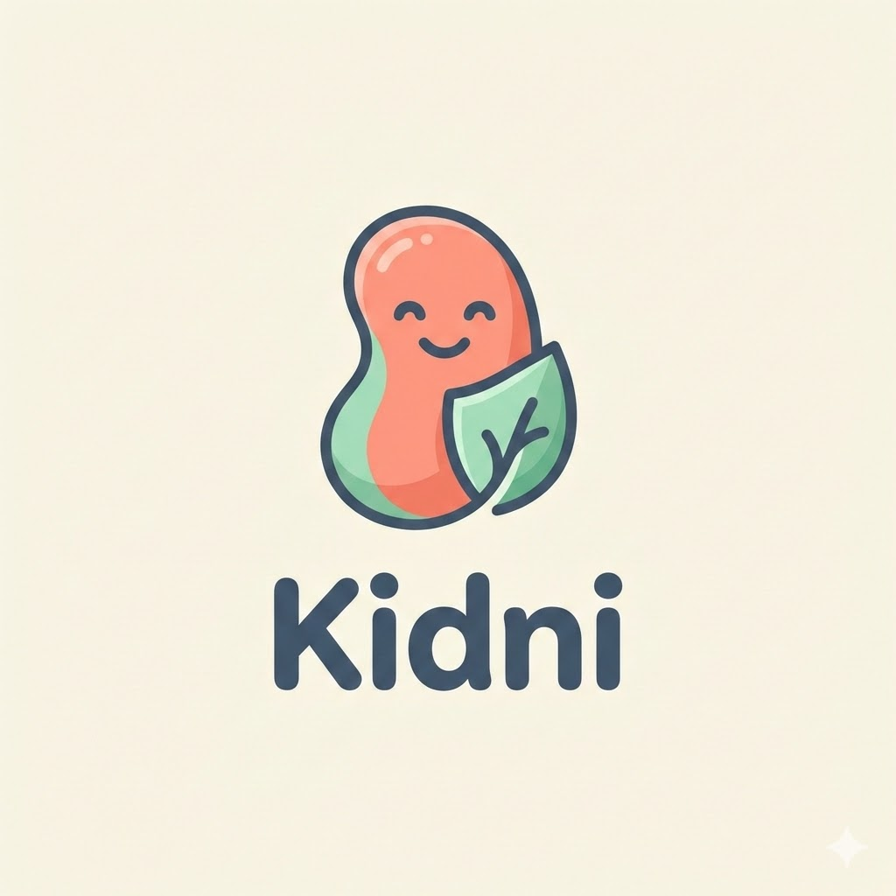

# Kidni · קידני

A gamified, offline-first app that teaches parents of children on dialysis which foods are safe, one picture at a time.

<p align="center"></p>

**[Download the Android APK](https://github.com/Mhemd139/Kidni/releases/latest)** · Flutter · works offline · no account, no tracking

## Why

Children with chronic kidney disease (CKD) on dialysis have to keep **phosphorus (זרחן)** and **potassium (אשלגן)** low. Parents get the rules as dense pamphlets and food lists, then have to apply them in seconds in a supermarket aisle or a kitchen. Kidni turns the clinical guidelines into quick picture-based choices that parents practice until the right answer is automatic.

## Impact

Validated in a real clinical setting at **Schneider Children's Medical Center of Israel**:

- **28% increase in awareness**, measured by a pre/post survey of caregivers in the hospital's Dialysis Department after they used the app.
- **Recognized at Schneider's Innovation Center**: among the projects presented at the center's showcase, Kidni drew the most attention from the hospital's committee.

## How it works

- **5 levels × 8 questions**, from Beginner (מתחיל) to Doctor (דוקטור): breakfast basics, cooking techniques, snacks and drinks, processed foods, labels and additives.
- **Image-led questions**: each shows an everyday food scenario with two options. The answer turns green or red and explains the medical reason.
- **Progression**: 6/8 unlocks the next level and a new avatar. Replays never lower a best score ([scoring design](docs/HIGH_SCORE_LOGIC.md)).
- **Hebrew, with an Arabic translation in review**; full right-to-left layout on phones and tablets.
- **Private by design**: no login, no analytics, no permission prompts. Progress stays on the device (`shared_preferences`), and "Reset progress" wipes it.

Content is based on the clinical guidelines of Israeli nephrology departments (*The Phosphate Poster*, *The Potassium Guide*).

## Code

Flutter and Dart, with plain `setState` and one `LevelManager` singleton for unlocks, scores, and avatars.

| Path | Contents |
| --- | --- |
| `lib/screens/` | Home (levels), quiz, review, level-up dialog |
| `lib/models/models.dart` | Question model and `LevelManager` |
| `lib/data/` | The 40 questions: `questions_data.dart` (Hebrew, source of truth) and `questions_ar.dart` (Arabic) |
| `lib/i18n/` | Language switch and UI strings |

## Run it

```bash
flutter pub get
flutter run                  # a device, an emulator, or -d chrome
flutter analyze && flutter test
flutter build apk --release --split-per-abi
```

---

Built with ❤️ for the fighters of the Dialysis Department.
